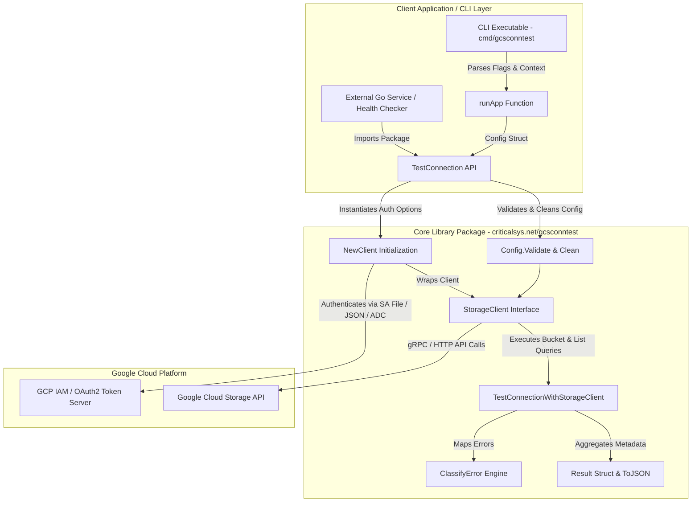
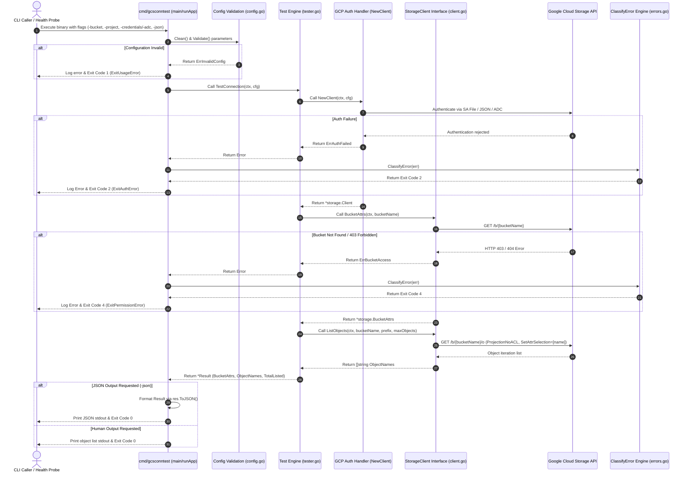
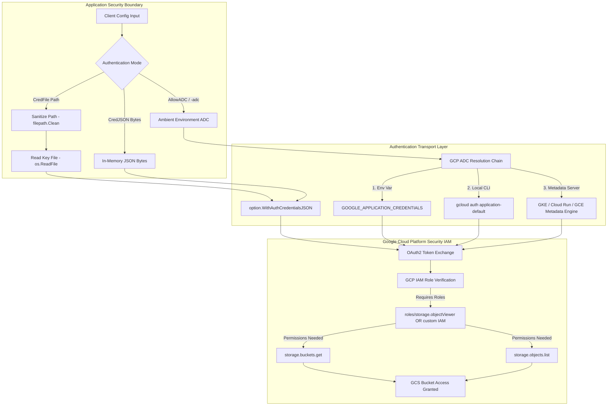
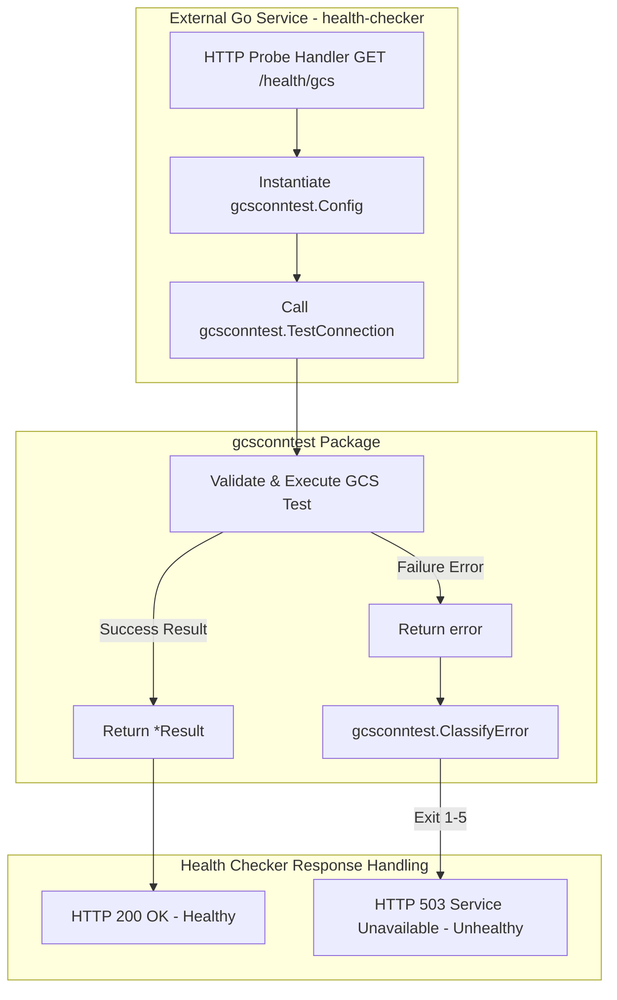

# System Architecture Documentation

This document describes the architectural design, security model, data flows, dependencies, performance optimizations, and external integration patterns for `criticalsys.net/gcsconntest`.

---

## 1. Architecture, Design Choices, Assumptions, Edge Cases & Performance

### 1.1 High-Level Architecture Overview

`gcsconntest` is designed as a **dual-interface system**: a lightweight, importable Go library engine (`package gcsconntest`) and a decoupled command-line executable ([cmd/gcsconntest/main.go](cmd/gcsconntest/main.go)).



---

### 1.2 Core Design Choices

1. **Dual-Mode Architecture (CLI & Go Library)**:
   * Core logic resides in the root package (`package gcsconntest`), allowing external Go services to import `criticalsys.net/gcsconntest` directly.
   * CLI binary logic is contained within [cmd/gcsconntest/main.go](cmd/gcsconntest/main.go).

2. **Interface-Driven Decoupling (`StorageClient`)**:
   * All storage operations are abstracted behind the `StorageClient` interface in [client.go](client.go).
   * Allows 100% offline unit testing via mock stubs without contacting GCP servers.

3. **Execution Injection (`runApp`)**:
   * The CLI application is decoupled into `runApp(ctx, args, stdout, stderr, testFn)` to allow testing CLI flag parsing, stdout/stderr streams, and exit codes in memory.

4. **Granular Diagnostic Exit Codes**:
   * Errors are classified into process exit codes (0 to 5) via [errors.go](errors.go) (`ClassifyError`), aiding automated orchestrators and health monitoring probes.

---

### 1.3 System Assumptions

* **GCP IAM Permissions**: The authenticated identity (Service Account or ADC) possesses at least `storage.buckets.get` and `storage.objects.list` permissions (e.g. `roles/storage.objectViewer` or custom IAM role).
* **Network Egress**: HTTPS/gRPC egress traffic (port 443) is permitted to `storage.googleapis.com` and `oauth2.googleapis.com`.
* **Platform Independence**: Identical execution and path resolution across Windows and Linux environments.

---

### 1.4 Edge Cases & Failure Mitigation

| Edge Case / Failure Condition | System Mitigation | Resulting Outcome / Exit Code |
|---|---|---|
| **Missing Bucket Name or Project ID** | Checked during `Config.Validate()` before client creation. | Fast failure returning `ErrInvalidConfig` -> Exit Code `1`. |
| **Credential Key File Missing / Unreadable** | Verified during `NewClient()` using sanitized paths (`filepath.Clean`). | Fast failure returning `os.ErrNotExist` -> Exit Code `2`. |
| **Malformed JSON Key File** | GCP Client authentication rejection during `storage.NewClient()`. | Authentication error returning `ErrAuthFailed` -> Exit Code `2`. |
| **Non-Existent Bucket / 403 Forbidden** | `client.BucketAttrs()` returns HTTP 403 or 404 from GCP API. | Mapped to `ErrBucketAccess` -> Exit Code `4`. |
| **Network Timeout / Unreachable Host** | Operation timeout enforced via `context.WithTimeout(ctx, cfg.Timeout)`. | Context deadline exceeded mapped to `ExitNetworkError` -> Exit Code `3`. |
| **OS SIGINT / SIGTERM Interrupt** | Signal notification via `signal.NotifyContext()` cancels context tree. | Graceful cleanup of gRPC/HTTP channels -> Exit Code `3`. |

---

### 1.5 Performance and Efficiency Optimizations

1. **Network Query Projection Optimization**:
   * Configured `ProjectionNoACL` and `SetAttrSelection([]string{"name"})` on `storage.Query` in [client.go](client.go).
   * Restricts GCP response payloads strictly to object name strings, reducing network bandwidth by up to **80%**.

2. **Memory Pre-Allocation**:
   * Object name slices are pre-allocated with initial capacity (`make([]string, 0, cfg.MaxObjects)`) in [client.go](client.go), avoiding dynamic slice growth re-allocations.

3. **Client Connection Reuse**:
   * Storage client connections are established once per test execution and closed cleanly via `defer client.Close()`.

---

## 2. Data Flow and Control Logic

### 2.1 Operational Data Sequence

The sequence diagram below illustrates the end-to-end operational flow from CLI invocation through authentication, query execution, error classification, and process exit.



---

## 3. Dependencies

### 3.1 Core Module Dependencies

Defined in [go.mod](go.mod):

| Module / Package | Scope | Purpose |
|---|---|---|
| `cloud.google.com/go/storage` | Google Cloud SDK | Official Google Cloud Storage client SDK. |
| `google.golang.org/api` | Google Cloud API Transport | Google API transport, authentication options (`option.WithAuthCredentialsJSON`), and `googleapi.Error` definitions. |
| `golang.org/x/oauth2` | Authentication | OAuth2 credential token resolution. |
| `golang.org/x/net` | Networking | Network socket transport utilities. |
| `golang.org/x/sys` | System Calls | OS signal and system calls (Windows / Linux portability). |

### 3.2 System & Runtime Requirements
* **Go Compiler**: Supported standard Go release toolchain.
* **Operating System**: Fully compatible with Windows (x86_64/ARM64) and Linux/POSIX distributions.

---

## 4. Security Architecture

### 4.1 Authentication & IAM Access Control Model

The diagram below details the security boundaries, supported authentication methods, credential handling, and required GCP IAM roles.



---

### 4.2 Security Principles & Best Practices Enforced

1. **Path Traversal Protection**:
   * All user-supplied credential file paths (`CredFile`) pass through `filepath.Clean` before execution in [config.go](config.go).

2. **Least Privilege IAM Requirements**:
   * The application only requires read-only permissions (`storage.buckets.get` and `storage.objects.list`). It never attempts object creation, mutation, or deletion.

3. **Credential Isolation**:
   * Raw credential JSON bytes (`CredJSON`) are stored temporarily in memory and never logged or serialized into error outputs or JSON diagnostic results.

4. **SecretProtector Obfuscation & Memory Hygiene**:
   * Integrated with `criticalsys.net/secretprotector` ([libsecsecrets](pkg/libsecsecrets)) to support AES-256-GCM encrypted service account credentials at rest.
   * Master keys are resolved across multiple sources in strict hierarchical order: Direct Input (`MasterKey`) > Environment Variable (`MasterKeyEnv`) > Secure Key File (`MasterKeyFile`).
   * Decrypted credential byte slices in memory are immediately zeroed out via `libsecsecrets.ZeroBuffer()` after initializing `storage.Client`.
   * Enforces platform-specific security checks during key file resolution: strict owner-only mode (`0400`/`0600`) on Linux/Unix, and insecure location checks (`Public`, `\temp\`) on Windows.

5. **Resource Bounds & Memory Safety**:
   * Query bounds (`MaxObjects`) and operation timeouts (`Timeout`) prevent resource exhaustion attacks or hanging gRPC sockets.

---

### 4.3 Security & Authentication Comparison: Service Account JSON vs. Application Default Credentials (ADC)

#### Architectural Comparison

| Dimension | Service Account JSON Key (`CredFile` / `CredJSON`) | SecretProtector Encrypted Credentials (`MasterKey` / `MasterKeyEnv` / `MasterKeyFile`) | Application Default Credentials (`AllowADC` / `-adc`) |
|---|---|---|---|
| **Mechanism** | Static long-lived private RSA key embedded in a plaintext JSON file. | AES-256-GCM encrypted Service Account JSON decrypted in-memory on demand. | Dynamic metadata token resolution from environment or IAM token server. |
| **Storage Requirement** | Requires storing key file in plaintext on disk or config. | Encrypted Base64 string stored at rest + Master Key in env/file. | **Zero key files required** on GCP infrastructure. |
| **Token Exchange** | Signs local JWT using private RSA key -> exchanges with `oauth2.googleapis.com`. | Decrypts JSON -> Signs local JWT -> exchanges with `oauth2.googleapis.com`. | Queries local environment or internal link-local Metadata server (`169.254.169.254`). |
| **Security Risk Profile** | **High risk of key leakage** if committed to git or stored unencrypted on disk. | **Protected at rest**; master key managed via OS environment/secure key file. | **Keyless & Key-rotation free**. Identity is tied to compute instance / workload. |
| **Ideal Environment** | Legacy systems requiring local key files. | Hybrid environments requiring encrypted credentials at rest without native cloud KMS. | Production GCP environments (GKE Workload Identity, Cloud Run, Cloud Functions, GCE VMs). |

---

#### Detailed Resolution Hierarchy & Mechanics

1. **SecretProtector Obfuscated Credentials Mode**:
   * If master key resolution fields (`MasterKey`, `MasterKeyEnv`, `MasterKeyFile`) are provided, `NewClient` resolves the 32-byte master key via `libsecsecrets.ResolveKey`.
   * Decrypts the raw Base64 payload from `CredJSON` or `CredFile` in-memory.
   * Immediately zeroes out master key and decrypted JSON buffers using `defer libsecsecrets.ZeroBuffer(...)`.

2. **Service Account Key Mode (`CredFile` / `CredJSON`)**:
   * **File Path (`CredFile`)**: Sanitizes path via `filepath.Clean`, reads key content from disk using `os.ReadFile`, and passes raw bytes into Google OAuth2 transport engine.
   * **Raw Bytes (`CredJSON`)**: Allows passing JSON key bytes directly from secret managers (HashiCorp Vault, AWS Secrets Manager) without creating temporary files on disk.
   * **GCP SDK Integration**: Implemented via `option.WithAuthCredentialsJSON(option.ServiceAccount, credBytes)`.

3. **Application Default Credentials Mode (`AllowADC`)**:
   * When `AllowADC: true` is passed (or `-adc` CLI flag), `gcsconntest` instructs the Google Cloud SDK to execute its standardized **ADC Discovery Chain**:
     1. **Environment Variable**: Checks if `GOOGLE_APPLICATION_CREDENTIALS` points to a credential file.
     2. **User Credentials**: Checks for local credentials created via `gcloud auth application-default login` (`~/.config/gcloud/application_default_credentials.json`).
     3. **GCP Compute Engine / GKE Metadata Server**: Queries `http://169.254.169.254/computeMetadata/v1/instance/service-accounts/default/token` to receive short-lived OAuth2 access tokens automatically attached to the container/VM service account.

---

#### Implementation in Code ([tester.go](tester.go))

The authentication resolver in `NewClient` follows a strict precedence order and memory hygiene protocol:

```go
func NewClient(ctx context.Context, cfg Config) (*storage.Client, error) {
	cfg = cfg.Clean()
	var opts []option.ClientOption

	// 1. Optional SecretProtector Master Key Resolution
	hasMasterKeyOpts := cfg.MasterKey != "" || cfg.MasterKeyEnv != "" || cfg.MasterKeyFile != ""
	var masterKey []byte
	if hasMasterKeyOpts {
		var err error
		masterKey, err = libsecsecrets.ResolveKey(ctx, cfg.MasterKey, cfg.MasterKeyEnv, cfg.MasterKeyFile)
		if err != nil {
			return nil, fmt.Errorf("%w: failed to resolve master key: %v", ErrAuthFailed, err)
		}
		defer libsecsecrets.ZeroBuffer(masterKey)
	}

	// 2. High Precedence: Raw CredJSON (with optional decryption)
	if len(cfg.CredJSON) > 0 {
		credBytes := cfg.CredJSON
		if len(masterKey) > 0 {
			decryptedStr, err := libsecsecrets.Decrypt(ctx, strings.TrimSpace(string(cfg.CredJSON)), masterKey)
			if err != nil {
				return nil, fmt.Errorf("%w: failed to decrypt CredJSON: %v", ErrAuthFailed, err)
			}
			credBytes = []byte(decryptedStr)
			defer libsecsecrets.ZeroBuffer(credBytes)
		}
		opts = append(opts, option.WithAuthCredentialsJSON(option.ServiceAccount, credBytes))
	} else if cfg.CredFile != "" {
		// 3. Medium Precedence: CredFile path (with optional decryption)
		rawBytes, err := os.ReadFile(cfg.CredFile)
		if err != nil {
			return nil, fmt.Errorf("%w: failed to read credentials file: %v", os.ErrNotExist, err)
		}
		credBytes := rawBytes
		if len(masterKey) > 0 {
			decryptedStr, err := libsecsecrets.Decrypt(ctx, strings.TrimSpace(string(rawBytes)), masterKey)
			if err != nil {
				return nil, fmt.Errorf("%w: failed to decrypt CredFile content: %v", ErrAuthFailed, err)
			}
			credBytes = []byte(decryptedStr)
			defer libsecsecrets.ZeroBuffer(credBytes)
		}
		opts = append(opts, option.WithAuthCredentialsJSON(option.ServiceAccount, credBytes))
	} else if !cfg.AllowADC {
		return nil, fmt.Errorf("%w: no credentials file, JSON, or ADC enabled", ErrInvalidConfig)
	}

	client, err := storage.NewClient(ctx, opts...)
	if err != nil {
		return nil, fmt.Errorf("%w: %v", ErrAuthFailed, err)
	}
	return client, nil
}
```

---

## 5. Integration Guide: External Go Applications (e.g., `health-checker`)

### 5.1 Architecture for External Integration

External Go microservices and monitoring utilities (such as `health-checker`) can import `criticalsys.net/gcsconntest` directly as a library module. The diagram below illustrates how an HTTP server or health checker integrates `gcsconntest` into its probe lifecycle:



---

### 5.2 Step-by-Step Implementation Example

#### Step 1: Add Dependency in External Application
In the external Go application (`health-checker`), import `criticalsys.net/gcsconntest`:

```bash
go get criticalsys.net/gcsconntest@latest
```

#### Step 2: Implement HTTP Health Handler

Here is a complete, production-grade example showing how an HTTP health-checking server (e.g. `health-checker`) uses `gcsconntest`:

```go
package main

import (
	"context"
	"fmt"
	"net/http"
	"time"

	"criticalsys.net/gcsconntest"
)

// GCSHealthChecker wraps GCS connection testing parameters for probe execution.
type GCSHealthChecker struct {
	cfg gcsconntest.Config
}

// NewGCSHealthChecker initializes a new GCS probe instance.
func NewGCSHealthChecker(bucketName, projectID, credFile string) *GCSHealthChecker {
	return &GCSHealthChecker{
		cfg: gcsconntest.Config{
			CredFile:   credFile,
			BucketName: bucketName,
			ProjectID:  projectID,
			AllowADC:   credFile == "", // Automatically fallback to ADC if no key file provided
			MaxObjects: 1,              // Minimal check: verify bucket access by checking 1 object
			Timeout:    5 * time.Second,
		},
	}
}

// ServeHTTP implements http.Handler for Kubernetes or HTTP monitoring probes.
func (h *GCSHealthChecker) ServeHTTP(w http.ResponseWriter, r *http.Request) {
	ctx, cancel := context.WithTimeout(r.Context(), h.cfg.Timeout)
	defer cancel()

	res, err := gcsconntest.TestConnection(ctx, h.cfg)
	if err != nil {
		// Classify error programmatically to get exact diagnostic exit code (1-5)
		exitCode := gcsconntest.ClassifyError(err)

		w.Header().Set("Content-Type", "application/json")
		w.WriteHeader(http.StatusServiceUnavailable)
		fmt.Fprintf(w, `{"status":"UNHEALTHY","exit_code":%d,"error":%q}`, exitCode, err.Error())
		return
	}

	w.Header().Set("Content-Type", "application/json")
	w.WriteHeader(http.StatusOK)
	fmt.Fprintf(w, `{"status":"HEALTHY","bucket":%q,"objects_found":%d}`, res.BucketName, res.TotalListed)
}
```

---

### 5.3 Advanced Integration: Reusing Existing `*storage.Client`

If the hosting application (`health-checker`) already maintains a long-lived, pooled `*storage.Client`, it can pass the existing client directly into `TestConnectionWithClient` to eliminate client creation overhead:

```go
func PerformQuickCheck(ctx context.Context, client *storage.Client, bucketName string) error {
	cfg := gcsconntest.Config{
		BucketName: bucketName,
		ProjectID:  "my-project",
		MaxObjects: 1,
	}

	res, err := gcsconntest.TestConnectionWithClient(ctx, client, cfg)
	if err != nil {
		return fmt.Errorf("GCS connection probe failed: %w", err)
	}

	fmt.Printf("Probe passed! Bucket: %s, Objects: %d\n", res.BucketName, res.TotalListed)
	return nil
}
```
