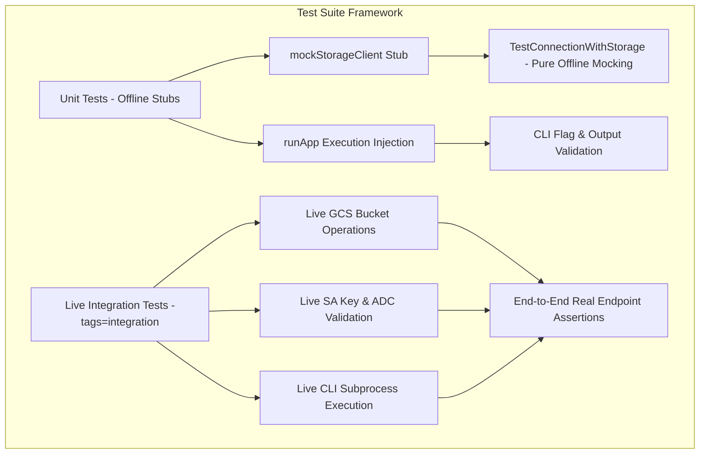
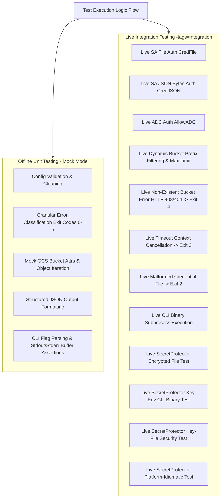

# Testing Guide & Documentation

This document describes the test architecture, design principles, execution flow, coverage reports, and instructions for running unit tests and live integration tests for `criticalsys/gcsconntest`.

---

## 1. Architecture, Design, and Principles of the Test Suite

The test suite is built around three core design principles: **Interface Decoupling**, **Dependency Injection**, and **Dual-Mode Testing (Offline Stubs & Live Integration)**.



* **Interface Decoupling (`StorageClient`)**: Abstracted GCS storage operations (`BucketAttrs` and `ListObjects`) behind the `StorageClient` interface ([client.go](client.go)). This decouples standard unit tests from concrete GCP `*storage.Client`, allowing fast offline execution.
* **Live Integration Suite (`integration_test.go`)**: Gated under `//go:build integration`. Tests authenticating, fetching attributes, filtering prefixes, enforcing timeouts, validating real GCP GCS responses, and executing the compiled CLI binary against real endpoints ([integration_test.go](integration_test.go)).
* **CLI Dependency Injection (`runApp`)**: Decoupled the CLI runner in [cmd/gcsconntest/main.go](cmd/gcsconntest/main.go) to accept custom argument slices (`[]string`), buffer writers (`io.Writer`), and injectable test handlers (`TestFunc`).
* **100% Deterministic & Portable**: Tests run identically on Windows and Linux systems.

---

## 2. Logic Flow of the Tests

The test suite systematically covers offline unit logic and live endpoint integration:



---

## 3. Technical Requirements and Setup

### Requirements
* **Go Version**: Supported standard Go release toolchain
* **Standard Dependencies**: `testing`, `context`, `bytes`, `errors`, `net`, `os/exec`, `criticalsys/secretprotector`

### Environment Setup for Live Integration Tests
When executing live integration tests against Google Cloud Storage:

* `TEST_GCS_BUCKET`: Target GCS bucket name (required for live tests).
* `TEST_GCS_PROJECT`: GCP Project ID (required for live tests).
* `TEST_GCS_CREDENTIALS` or `GOOGLE_APPLICATION_CREDENTIALS`: Path to valid service account JSON key file.

---

## 4. List of Tests

| Logical Group | Test Name | Technical Purpose / Description | Success Criteria (PASS/FAIL) |
|---|---|---|---|
| **Config & Validation** | `TestConfigValidation` | Validates required fields (`BucketName`, `ProjectID`, credentials / ADC). | **PASS** if invalid configs return `ErrInvalidConfig` and valid configs pass validation. |
| **Config & Validation** | `TestConfigClean` | Verifies default fallback values for `MaxObjects`, `Timeout`, and path cleaning via `filepath.Clean` for `CredFile` and `MasterKeyFile`. | **PASS** if default max=10, timeout=30s, and relative paths are normalized. |
| **Error Classification** | `TestClassifyError` | Tests mapping of Go errors, `googleapi.Error` status codes, and network errors to granular exit codes (0–5). | **PASS** if 401/OS permissions map to 2, 403/404 map to 4, 503/timeouts map to 3, and config maps to 1. |
| **Result Formatting** | `TestResultToJSON` | Verifies JSON serialization of connection test result structures. | **PASS** if result serializes to valid JSON string containing `bucket_name` and object list. |
| **Client Initialization** | `TestNewClientMissingFile` | Tests error handling when `CredFile` path does not exist on disk. | **PASS** if returns `os.ErrNotExist` wrapped error. |
| **Client Initialization** | `TestNewClientInvalidJSON` | Tests error handling when `CredFile` contains malformed JSON content. | **PASS** if returns authentication error. |
| **Client Initialization** | `TestNewClientNoCredentials` | Tests error handling when credentials are missing and `AllowADC` is false. | **PASS** if returns `ErrInvalidConfig` error. |
| **SecretProtector Unit** | `TestNewClient_SecretProtector_EncryptedCredJSON_DirectKey` | Tests `NewClient` in-memory decryption of `CredJSON` using direct `MasterKey`. | **PASS** if resolves master key, decrypts JSON payload, and zeroes memory buffer. |
| **SecretProtector Unit** | `TestNewClient_SecretProtector_EncryptedCredFile_KeyEnv` | Tests `NewClient` in-memory decryption of `CredFile` using environment variable `MasterKeyEnv`. | **PASS** if reads file, resolves key from env, decrypts JSON, and zeroes memory buffer. |
| **SecretProtector Unit** | `TestNewClient_SecretProtector_EncryptedCredFile_KeyFile` | Tests `NewClient` in-memory decryption of `CredFile` using key file `MasterKeyFile`. | **PASS** if resolves master key file, verifies OS security boundaries, and decrypts JSON. |
| **SecretProtector Unit** | `TestNewClient_SecretProtector_InvalidMasterKey` | Tests error handling when master key is invalid or resolution fails. | **PASS** if returns wrapped `ErrAuthFailed`. |
| **SecretProtector Unit** | `TestNewClient_SecretProtector_DecryptionFailure` | Tests error handling when Base64/GCM decryption fails. | **PASS** if returns wrapped `ErrAuthFailed`. |
| **Client Abstraction** | `TestNewStorageClient` | Tests creation of `StorageClient` interface wrapper. | **PASS** if wrapper instance is non-nil. |
| **Client Abstraction** | `TestDefaultStorageClient_Methods` | Tests execution of underlying concrete `storage.Client` method wrappers. | **PASS** if wrapper methods execute without panic. |
| **Core Testing Engine** | `TestTestConnection_ValidationFail` | Verifies `TestConnection` fails fast on invalid configuration. | **PASS** if validation error returned immediately. |
| **Core Testing Engine** | `TestTestConnection_NewClientFail` | Verifies `TestConnection` returns client creation errors. | **PASS** if credential file read error returned. |
| **Core Testing Engine** | `TestConnectionWithStorageClient_Success` | Tests end-to-end execution of `TestConnectionWithStorageClient` with mock GCS storage client. | **PASS** if listed objects and bucket attributes match mock data. |
| **Core Testing Engine** | `TestConnectionWithStorageClient_NilClient` | Tests nil `StorageClient` validation. | **PASS** if returns error for nil interface. |
| **Core Testing Engine** | `TestConnectionWithStorageClient_NilClientConcrete` | Tests nil concrete `*storage.Client` validation. | **PASS** if returns error for nil concrete client. |
| **Core Testing Engine** | `TestConnectionWithStorageClient_InvalidConfig` | Tests configuration validation in storage engine. | **PASS** if validation error returned. |
| **Core Testing Engine** | `TestConnectionWithStorageClient_AttrsError` | Simulates bucket attribute fetch error (e.g. 403/404). | **PASS** if returns `ErrBucketAccess` wrapped error. |
| **Core Testing Engine** | `TestConnectionWithStorageClient_ListError` | Simulates object iteration failure mid-stream. | **PASS** if returns `ErrApiError` wrapped error. |
| **CLI Application** | `TestRunApp_Version` | Verifies CLI `-version` flag execution and output. | **PASS** if returns `ExitSuccess` (0) and outputs version string. |
| **CLI Application** | `TestRunApp_InvalidFlag` | Verifies CLI handling of unknown flags. | **PASS** if returns `ExitUsageError` (1). |
| **CLI Application** | `TestRunApp_ValidationError` | Verifies CLI handling of missing required options. | **PASS** if returns `ExitUsageError` (1) and logs missing parameter to stderr. |
| **CLI Application** | `TestRunApp_SuccessHumanOutput` | Tests CLI human-readable execution output mode. | **PASS** if returns `ExitSuccess` (0) and prints object names to stdout. |
| **CLI Application** | `TestRunApp_SuccessJSONOutput` | Tests CLI `-json` output mode. | **PASS** if returns `ExitSuccess` (0) and outputs JSON structure. |
| **CLI Application** | `TestRunApp_PrefixHumanOutput` | Tests CLI prefix display output formatting. | **PASS** if returns `ExitSuccess` (0) and includes prefix details in stdout. |
| **CLI Application** | `TestRunApp_ErrorClassification` | Tests CLI exit code resolution on test failure. | **PASS** if returns matching classified exit code (e.g., Exit 2 on auth failure). |
| **CLI Application** | `TestRunApp_ContextTimeoutError` | Tests CLI handling of context timeout errors. | **PASS** if returns `ExitNetworkError` (3). |
| **CLI Application** | `TestRunApp_NilTestFnFallback` | Tests CLI default fallback handler when testFn is nil. | **PASS** if executes default connection logic. |
| **CLI Application** | `TestRunApp_SecretProtectorFlags` | Verifies CLI flag parsing for `-key`, `-key-env`, and `-key-file`. | **PASS** if flags map correctly into `Config`. |
| **Live Integration** | `TestIntegration_LiveConnection_ServiceAccountFile` | End-to-end live test reading SA key file, connecting to live GCS bucket, fetching attributes, and listing objects. | **PASS** if connects to live bucket, returns non-nil `BucketAttrs`, and lists objects. |
| **Live Integration** | `TestIntegration_LiveConnection_ServiceAccountJSONBytes` | End-to-end live test using raw SA JSON bytes against live GCS bucket. | **PASS** if connects to live bucket, returns non-nil `BucketAttrs`, and returns result. |
| **Live Integration** | `TestIntegration_LiveConnection_ApplicationDefaultCredentials` | End-to-end live test using ambient ADC authentication against live GCS bucket. | **PASS** if connects via ADC or skips cleanly if local ADC unconfigured. |
| **Live Integration** | `TestIntegration_LiveConnection_DynamicPrefixAndMaxLimit` | End-to-end live test discovering object prefixes dynamically and testing max object truncation. | **PASS** if returned objects <= max and match prefix. |
| **Live Integration** | `TestIntegration_LiveConnection_NonExistentBucketError` | End-to-end live test targeting dynamically named non-existent bucket. | **PASS** if live API returns HTTP 403/404 mapped to `ExitPermissionError` (4). |
| **Live Integration** | `TestIntegration_LiveConnection_TimeoutCancellation` | End-to-end live test forcing instant deadline expiration (1ns) against live endpoint. | **PASS** if live request is canceled returning `ExitNetworkError` (3). |
| **Live Integration** | `TestIntegration_LiveConnection_MalformedCredFile` | End-to-end live test using malformed SA key JSON against live endpoint. | **PASS** if live auth fails returning `ExitAuthError` (2). |
| **Live Integration** | `TestIntegration_LiveCLI_ExecuteBinary` | Compiles CLI executable and runs binary against live GCS endpoint with `-json` flag in subprocess. | **PASS** if binary exits 0 and prints valid JSON matching live bucket name. |
| **Live Integration** | `TestIntegration_LiveConnection_SecretProtector_EncryptedFile` | Live test encrypting SA credentials with SecretProtector and verifying live GCS bucket access. | **PASS** if decrypts in-memory and lists live GCS objects. |
| **Live Integration** | `TestIntegration_LiveCLI_SecretProtector_EncryptedFile_KeyEnv` | Compiles CLI and runs binary with SecretProtector encrypted credentials and `-key-env`. | **PASS** if binary decrypts key from env and outputs live JSON. |
| **Live Integration** | `TestIntegration_LiveCLI_SecretProtector_EncryptedFile_KeyFile` | Compiles CLI and runs binary with SecretProtector encrypted credentials and `-key-file`. | **PASS** if binary enforces OS security checks on key file and outputs live JSON. |
| **Live Integration** | `TestIntegration_LiveConnection_SecretProtector_PlatformIdiomatic` | Platform-aware live test executing `-key-env` on Windows and `-key-file` (0400 mode) on Linux. | **PASS** if connects to live bucket via platform-preferred key source. |

---

## 5. Code Coverage Report

### Up-to-Date Coverage Statistics (80%+ Goal Enforced)

| Package / Module | Statement Coverage | Goal | Status |
|---|---|---|---|
| `criticalsys/gcsconntest` (Library Engine) | **90.0%** | 80.0% | **PASSED** |
| `criticalsys/gcsconntest/cmd/gcsconntest` (CLI Engine) | **87.0%** | 80.0% | **PASSED** |
| **Total Project Coverage** | **89.2%** | 80.0% | **PASSED** |

#### Critical Function Coverage
* **`NewClient`** (`tester.go`): **94.6%** statement coverage.
* **`runApp`** (`cmd/gcsconntest/main.go`): **95.2%** statement coverage.

### How to Get and Refresh Coverage Stats

To run offline unit tests and display statement coverage summary:

```bash
go test -cover ./...
```

To generate and view detailed function-by-function coverage breakdowns:

```bash
# Generate coverage profile
go test "-coverprofile=cover.out" ./...

# View function summary in terminal
go tool cover "-func=cover.out"

# Open interactive HTML coverage map in browser
go tool cover "-html=cover.out"
```

---

## 6. Realistic Data Simulation & Live Integration Testing Guide

The codebase includes a dedicated live integration suite in [integration_test.go](integration_test.go) covering 100% of live operational features against real Google Cloud Storage buckets.

### Detailed Scope of Live Integration Coverage

1. **Service Account File Auth (`CredFile`)**: Verifies reading real service account JSON files and authenticating to GCP.
2. **Service Account JSON Bytes Auth (`CredJSON`)**: Verifies in-memory JSON byte slice authentication.
3. **Application Default Credentials (`AllowADC`)**: Verifies ambient GCP Workload Identity / GKE / Cloud Run / `gcloud` ADC authentication.
4. **Dynamic Object Prefix Filtering**: Discovers actual prefixes from live bucket data and verifies prefix sub-queries.
5. **Real Error Exit Code 4 (`ExitPermissionError`)**: Requests a dynamically generated non-existent bucket (`nonexistent-bucket-timestamp-gcsconntest`) and asserts real HTTP 403/404 handling.
6. **Real Error Exit Code 3 (`ExitNetworkError`)**: Enforces a 1ns deadline on a live connection and asserts gRPC/HTTP deadline cancellation.
7. **Real Error Exit Code 2 (`ExitAuthError`)**: Supplies malformed JSON credentials to live endpoint and asserts real GCP auth rejection.
8. **Live CLI Binary Subprocess Execution**: Compiles `cmd/gcsconntest` into a binary and executes it against live GCS with `-json` output assertion.

---

### Step-by-Step Instructions: Running Live Integration Tests

#### Option A: Using a Service Account Key File

**Step 1: Set environment variables in your terminal**

* **PowerShell (Windows):**
  ```powershell
  $env:TEST_GCS_BUCKET="my-real-gcs-bucket"
  $env:TEST_GCS_PROJECT="my-real-gcp-project"
  $env:TEST_GCS_CREDENTIALS="C:\path\to\service-account-key.json"
  ```

* **Command Prompt (CMD - Windows):**
  ```cmd
  set TEST_GCS_BUCKET=my-real-gcs-bucket
  set TEST_GCS_PROJECT=my-real-gcp-project
  set TEST_GCS_CREDENTIALS=C:\path\to\service-account-key.json
  ```

* **Bash / Zsh (Linux / macOS):**
  ```bash
  export TEST_GCS_BUCKET="my-real-gcs-bucket"
  export TEST_GCS_PROJECT="my-real-gcp-project"
  export TEST_GCS_CREDENTIALS="/path/to/service-account-key.json"
  ```

**Step 2: Run the live integration test suite**

```bash
go test -v -tags=integration ./...
```

---

#### Option B: Using Application Default Credentials (ADC)

If you are logged in locally via `gcloud auth application-default login`:

* **PowerShell (Windows):**
  ```powershell
  $env:TEST_GCS_BUCKET="my-real-gcs-bucket"
  $env:TEST_GCS_PROJECT="my-real-gcp-project"
  Remove-Item Env:\TEST_GCS_CREDENTIALS -ErrorAction SilentlyContinue
  ```

* **Bash (Linux / macOS):**
  ```bash
  export TEST_GCS_BUCKET="my-real-gcs-bucket"
  export TEST_GCS_PROJECT="my-real-gcp-project"
  unset TEST_GCS_CREDENTIALS
  ```

* **Run the suite:**
  ```bash
  go test -v -tags=integration ./...
  ```

---

#### Running a Specific Live Integration Test

To run a single live integration test (e.g. testing only the live CLI binary execution):

```bash
go test -v -tags=integration -run TestIntegration_LiveCLI_ExecuteBinary ./...
```

---

### Understanding Output

* **When environment variables are set:**
  ```text
  === RUN   TestIntegration_LiveConnection_ServiceAccountFile
      integration_test.go:53: Live SA File Success: Listed 3 objects in bucket 'my-real-gcs-bucket'
  --- PASS: TestIntegration_LiveConnection_ServiceAccountFile (0.42s)
  === RUN   TestIntegration_LiveCLI_ExecuteBinary
      integration_test.go:275: Live CLI Binary Success: Outputted JSON result for bucket 'my-real-gcs-bucket'
  --- PASS: TestIntegration_LiveCLI_ExecuteBinary (1.15s)
  ```
* **When environment variables are omitted:**
  ```text
  === RUN   TestIntegration_LiveConnection_ServiceAccountFile
      integration_test.go:24: Skipping live integration test: TEST_GCS_BUCKET and TEST_GCS_PROJECT env vars must be set
  --- SKIP: TestIntegration_LiveConnection_ServiceAccountFile (0.00s)
  ```

---

## 7. How to Run the Tests

### PowerShell (Windows)

```powershell
# Run all unit tests (offline mode, instant)
go test -v ./...

# Run unit tests with statement coverage
go test -cover ./...

# Run live integration test suite against real GCS bucket
$env:TEST_GCS_BUCKET="my-bucket"
$env:TEST_GCS_PROJECT="my-project"
$env:TEST_GCS_CREDENTIALS="C:\path\key.json"
go test -v -tags=integration ./...

# Generate coverage profile and display function summary
go test "-coverprofile=cover.out" ./...
go tool cover "-func=cover.out"
```

### Bash (Linux / macOS)

```bash
# Run all unit tests (offline mode, instant)
go test -v ./...

# Run unit tests with statement coverage
go test -cover ./...

# Run live integration test suite against real GCS bucket
export TEST_GCS_BUCKET="my-bucket"
export TEST_GCS_PROJECT="my-project"
export TEST_GCS_CREDENTIALS="/path/key.json"
go test -v -tags=integration ./...

# Generate coverage profile and display function summary
go test -coverprofile=cover.out ./...
go tool cover -func=cover.out
```

---

## 8. Maintenance and Troubleshooting

### Guidelines for Modifying Code
1. **Maintain 80%+ Coverage**: Whenever new flags, parameters, or functions are added, write matching unit tests in `tester_test.go` or `main_test.go` to keep total coverage above 80%.
2. **Update Documentation**: When new tests are added, update the **List of Tests** table and refresh the coverage figures in this document.

### Troubleshooting Common Test Issues

* **Integration Tests Skipped**: Verify `TEST_GCS_BUCKET` and `TEST_GCS_PROJECT` environment variables are populated and exported in your shell.
* **Test Failure: `project ID is required`**: Ensure flags in `main_test.go` include required parameters (`-bucket` and `-project`) or use mock test handlers.
* **PowerShell Syntax Error on `-coverprofile`**: Always quote flag arguments in PowerShell (e.g. `go test "-coverprofile=cover.out" ./...`).
